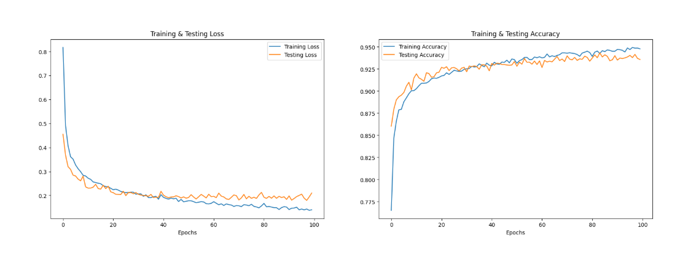
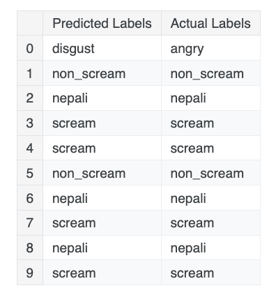
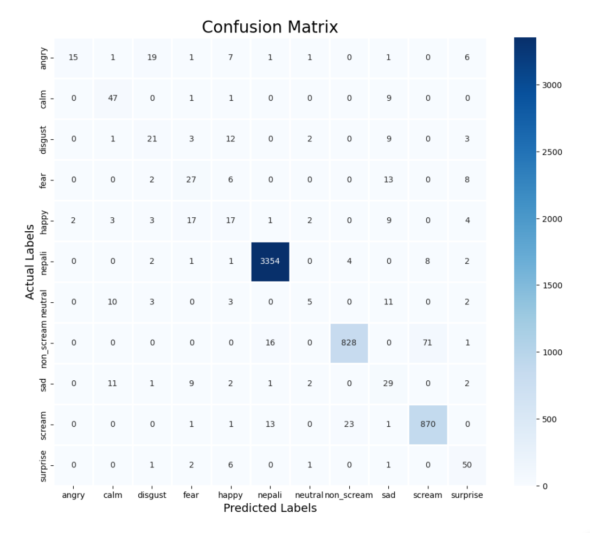

# SanoAwaj
Sano Awaj is our hackathon project. It is a web app that helps woman and underprivileged users report and prevent harrasment in a safe and easy way.

# Plan of Attack
### step 1: preparing dataset from kaggle
***NOTE : This dataset will be used for the speech and emotion recognition. I need more dataset for stress signals like (bachau, help, screaming by ***NEPALI*** women)***
- CREMA-D
- RAVDESS Emotional speech audio
- Surrey Audio-Visual Expressed Emotion (SAVEE)
- Toronto emotional speech set (TESS)
- Common Voice (Nepali) 
- OpenSLR SLR64

### step 2: Preprocessing Code 
***NOTE : we will be using librosa, tensorflow, keras for audio preprocessing and model training***
- CNN model will be used for image recognition for finding pattern. Eventhough, I'm working with audio, I need to convert audio into visual features like MFCCs(Mel Frequency Cepstral Coefficients) or spectogram and these are just 2D images
- If I want to detect pattern overtime and full sentences or emotion tone oveer 5 - 10 second then i need to use RNN and LSTM

### step 3: Flask and FastAPI as Backend Setup
***NOTE : I am not a pro in Flask and FastAPI but i will followw doing by learning.*** 
- /predict-audio/ using POST method. This function accept audio clip, run model prediction
- /trigger-alert/ using POST method. This function trigger a call to police and record a video 

### step 4: Connecting with Frontend
- Audio will be sent every 2-3 seconds via fetch()
- if model predict 'danger' then 
  - Starts video recording (WebRTC)
  - Calls to most trusted one looking phone contacts or police

### step 5: Deployment

### sample Workflow loop (live flow)
- Mic records audio on frontend via JS every 2 sec
- fetch("/predict-audio/") sends audio to Django
- Django runs .h5 model stored and returns prediction on real time.
- If "danger" detected:
  - Sends call via Twilio API
  - Triggers or alert on frontend

# Day (1 - 3) created Speech Emotion Recognition model
***step 1: Importing libraries, i imported libraries called librosa for displaying and extracting features from audio files. There are different libraries i used for data prepration, preprocessing, for splitting model, and for calculating metrics, I used confusion_matrix and classification_report because we are solving multi class classification problem. I also imported keras libraries, layers, models, callbacks for early stopping, and reducing learning rate.***

***step 2: I started creating the Speech emotion recognition model, by preprocessing.***
- audio of scream and non_scream dataset 
- ravdess-emotional-speech-audio/audio_speech_actors_01-24/
- nepali dataseet asr.
- nepali-tts/ne_np_female/wavs
***And concated whole dataset into one DataFrame with columns Emotions and Path of that file as vertically. Then I visualised the dataset creating a two function called create_waveplot and create spectogram and this function takes data and sample_rating and emotions which is extracted from librosa.load library.***

***Here's a code***
```
def create_waveplot(data, sr, e):
    plt.figure(figsize=(12, 7))
    plt.title(f'Waveplot for audio with {e} emotion', fontsize=18)
    librosa.display.waveshow(data, sr=sr)
    plt.show()
```
```
def create_spectogram(data, sr, e):
    X = librosa.stft(data)
    Xdb = librosa.amplitude_to_db(abs(X))
    plt.figure(figsize=(12, 3))
    plt.title(f'Spectogram for audio with {e} emotion', fontsize=18)
    librosa.display.specshow(Xdb, sr=sr, x_axis='time', y_axis='hz')
    plt.colorbar()
```
***step 3: Visualizing the each emotions using waveplot and wave spectogram. Then i also try to do Data Augmentation of audio files. Data augmentation is the process by which we create a new data samples by adding small features. My main objective is to add small features including:***
- adding noise and making random or unstructured
- stretching means speeding up or slowing down audio files 
- pitch shifting means changing the pitch
- shifting in time is rolling the wavefrom left/right Volume changes
***Here's code***
```
def noise(data):
    # uniform would generate a random integer and we will multiply by a maximum value in a given array
    adding_amp = 0.035*np.random.uniform()*np.amax(data)
    data = data + adding_amp * np.random.normal(size=data.shape[0])
    return data
    

def stretch(data, rate=0.8):
    # stretching time speeding up/slowing down by  rate 0.8
    return librosa.effects.time_stretch(data, rate=rate)

def shift(data):
    shift_range = int(np.random.uniform(low=-5, high=5)*1000)
    return np.roll(data, shift_range)

def pitch(data, sampling_rate, pitch_factor=0.7):
    return librosa.effects.pitch_shift(data, sr=sample_rate, n_steps=-6)

# taking any example and checking for techniques
path = np.array(Ravdess_df.Path)[1]
data, sample_rate = librosa.load(path)
```

***Extracting of Features is very important in anlyzing and funding relations between different frequency of data. We already know that the data provided of audio could not understood by our model directly. because this audio signal are in three dimensionl signal which represents time, amplitude and frequency. I also done several transformations of feature extraction of variables most easiest one.***
- ZCR aka Zero crossing rate defines how often audio signal switches from positive to negative and viceversa
- chroma vector is shows how much energy each of the 12 musical notes like((C, C#, D, etc).
- MFCC aka Mel Frequency Cepstral Coefficients is special numbers that describe the tone of sound using human hearing scale.
- Root Mean Square value
- MelSpectogram

***Here's code***
```
def extract_features(data):
    # ZCR
    result = np.array([])
    zcr = np.mean(librosa.feature.zero_crossing_rate(y=data).T, axis=0)
    result=np.hstack((result, zcr)) # stacking horizontally

    # Chroma_stft
    stft = np.abs(librosa.stft(data))
    chroma_stft = np.mean(librosa.feature.chroma_stft(S=stft, sr=sample_rate).T, axis=0)
    result = np.hstack((result, chroma_stft)) # stacking horizontally

    # MFCC
    mfcc = np.mean(librosa.feature.mfcc(y=data, sr=sample_rate).T, axis=0)
    result = np.hstack((result, mfcc)) # stacking horizontally

    # Root Mean Square Value
    rms = np.mean(librosa.feature.rms(y=data).T, axis=0)
    result = np.hstack((result, rms)) # stacking horizontally

    # MelSpectogram
    mel = np.mean(librosa.feature.melspectrogram(y=data, sr=sample_rate).T, axis=0)
    result = np.hstack((result, mel)) # stacking horizontally
    
    return result
```

***Then i process whole dataset and converted into the numerical features so that neural network could understand it.***

***step 4: Actual data preprocessing for training model and feature engineering. Created numpy array of X as independent variable with paths of each audio files and y as dependent variables as emotions and labeled. Since, this is a multi class classification problem so, splitting dataset into the training and test set. After that scaling the dataset by using standard scaler from sklearn. However my model needs dataset which has three dimension because remember the real dataset which has three dimension.***

***Here's how i added 4 layer of Conv1D, Maxpooling1D, Dropout layer.***

```
┏━━━━━━━━━━━━━━━━━━━━━━━━━━━━━━━━━┳━━━━━━━━━━━━━━━━━━━━━━━━┳━━━━━━━━━━━━━━━┓
┃ Layer (type)                    ┃ Output Shape           ┃       Param # ┃
┡━━━━━━━━━━━━━━━━━━━━━━━━━━━━━━━━━╇━━━━━━━━━━━━━━━━━━━━━━━━╇━━━━━━━━━━━━━━━┩
│ conv1d (Conv1D)                 │ (None, 162, 256)       │         1,536 │
├─────────────────────────────────┼────────────────────────┼───────────────┤
│ max_pooling1d (MaxPooling1D)    │ (None, 81, 256)        │             0 │
├─────────────────────────────────┼────────────────────────┼───────────────┤
│ dropout (Dropout)               │ (None, 81, 256)        │             0 │
├─────────────────────────────────┼────────────────────────┼───────────────┤
│ conv1d_1 (Conv1D)               │ (None, 81, 128)        │       163,968 │
├─────────────────────────────────┼────────────────────────┼───────────────┤
│ max_pooling1d_1 (MaxPooling1D)  │ (None, 41, 128)        │             0 │
├─────────────────────────────────┼────────────────────────┼───────────────┤
│ dropout_1 (Dropout)             │ (None, 41, 128)        │             0 │
├─────────────────────────────────┼────────────────────────┼───────────────┤
│ conv1d_2 (Conv1D)               │ (None, 41, 64)         │        41,024 │
├─────────────────────────────────┼────────────────────────┼───────────────┤
│ max_pooling1d_2 (MaxPooling1D)  │ (None, 21, 64)         │             0 │
├─────────────────────────────────┼────────────────────────┼───────────────┤
│ dropout_2 (Dropout)             │ (None, 21, 64)         │             0 │
├─────────────────────────────────┼────────────────────────┼───────────────┤
│ conv1d_3 (Conv1D)               │ (None, 21, 32)         │        10,272 │
├─────────────────────────────────┼────────────────────────┼───────────────┤
│ max_pooling1d_3 (MaxPooling1D)  │ (None, 11, 32)         │             0 │
├─────────────────────────────────┼────────────────────────┼───────────────┤
│ dropout_3 (Dropout)             │ (None, 11, 32)         │             0 │
├─────────────────────────────────┼────────────────────────┼───────────────┤
│ flatten (Flatten)               │ (None, 352)            │             0 │
├─────────────────────────────────┼────────────────────────┼───────────────┤
│ dense (Dense)                   │ (None, 32)             │        11,296 │
├─────────────────────────────────┼────────────────────────┼───────────────┤
│ dropout_4 (Dropout)             │ (None, 32)             │             0 │
├─────────────────────────────────┼────────────────────────┼───────────────┤
│ dense_1 (Dense)                 │ (None, 11)             │           363 │
└─────────────────────────────────┴────────────────────────┴───────────────┘
```

***Then i added Reduce Learning Parameters if a metric has stopped moving. I also added early stopping as Callbacks if there is no improvement in the loss for consecutive epochs then we will stop training.***
***Here's code***
```
# This callback will stop training when there is no improvement 
# in the loss for threee consecutive epochs
callback = keras.callbacks.EarlyStopping(
    monitor="val_loss",
    min_delta=0.001,
    patience=0.0001,
    verbose=1
)
```
```
# This will Reduce learning rate when a metric has stopped moving
reduce_lr = ReduceLROnPlateau(monitor='val_loss', factor=0.2, 
                              patience=5, min_lr=0.001)
```

***Then i fitted model with epochs = 100 with batch size = 64 as reduce_lr as callbacks and validation_test = (X_test, y_test)***
```
Epoch 98/100
352/352 ━━━━━━━━━━━━━━━━━━━━ 2s 6ms/step - accuracy: 0.9500 - loss: 0.1417 - val_accuracy: 0.9415 - val_loss: 0.1796 - learning_rate: 0.0010
Epoch 99/100
352/352 ━━━━━━━━━━━━━━━━━━━━ 2s 6ms/step - accuracy: 0.9520 - loss: 0.1331 - val_accuracy: 0.9371 - val_loss: 0.1940 - learning_rate: 0.0010
Epoch 100/100
352/352 ━━━━━━━━━━━━━━━━━━━━ 2s 6ms/step - accuracy: 0.9507 - loss: 0.1375 - val_accuracy: 0.9358 - val_loss: 0.2102 - learning_rate: 0.0010
```
***Accuracy of our model on test data is: 93.58% . I visualized model for loss (training and testing data) and Accuracy (training and testing data)***
```
176/176 ━━━━━━━━━━━━━━━━━━━━ 2s 6ms/step - accuracy: 0.9342 - loss: 0.2120
Accuracy of our model on test data:  93.58108043670654
```


***This is my predicted labels Vs actual labels***


***This is my confusion matrix of actual tested value vs predicted value***


***This is a classification report as metrics***
```
              precision    recall  f1-score   support

       angry       0.88      0.29      0.43        52
        calm       0.64      0.81      0.72        58
     disgust       0.40      0.41      0.41        51
        fear       0.44      0.48      0.46        56
       happy       0.30      0.29      0.30        58
      nepali       0.99      0.99      0.99      3372
     neutral       0.38      0.15      0.21        34
  non_scream       0.97      0.90      0.94       916
         sad       0.35      0.51      0.41        57
      scream       0.92      0.96      0.94       909
    surprise       0.64      0.82      0.72        61

    accuracy                           0.94      5624
   macro avg       0.63      0.60      0.59      5624
weighted avg       0.94      0.94      0.93      5624
```
***we can see our model is more accurate in predicting surprise, angry emotions and it makes sense also because audio files of these emotions differ from other files in pitch, speed, stretch.we overall achieved 91 % of accuracy on our test data and its decent score, but overfitting is happening. overfitting is a condition where the model is predicting great in training set but not predicting well in test set.***